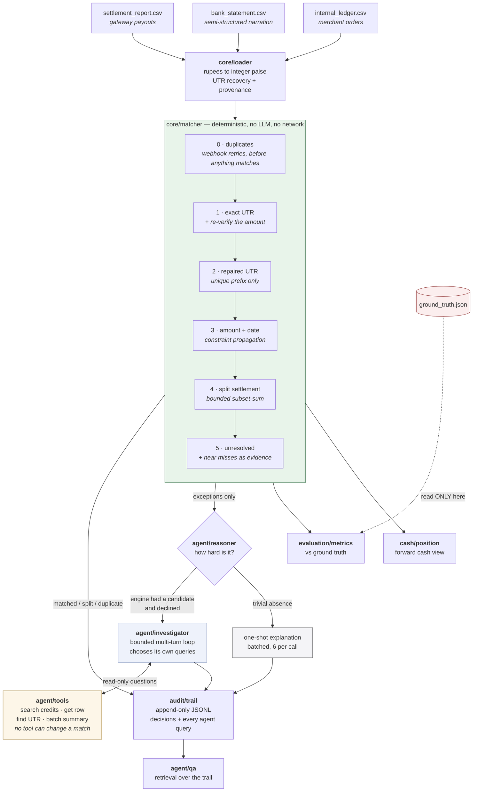

# ReconAgent

**Three-way payment reconciliation with an honest exception list.**

Razorpay AI Buildathon — Track 04, AI Finance Controller.

Every merchant on a payment gateway has to reconcile three systems of record each
settlement cycle: the gateway's settlement report, the bank statement, and their
own order ledger. They never agree cleanly. Fees and GST come off the top,
settlements land T+1 or T+2, one payout arrives as three credits, refunds land
partially, webhook retries duplicate rows, and paisa-level rounding puts amounts
just off. Today a person does this in a spreadsheet.

ReconAgent reconciles the three sources, reports measured accuracy against ground
truth it never sees, and for everything it cannot resolve produces a
human-readable investigation of **why** — including the cases where the right
answer is *"this cannot be determined, send it to a person."*

### The loop it closes

The track asks for one finance-ops loop closed across a 50+ record batch. This is
that loop, end to end, in a single command:

```
settlement report + bank statement + ledger        ← three disagreeing sources
        ↓  deterministic cascade, integer paise
    matched books                                  ← 63.5% of dev, 0 false positives
        ↓
    categorised exception queue                    ← every unmatched row, with why
        ↓
    forward cash position                          ← what is in the account, what is
                                                     owed, what needs a human today
```

A batch goes in; reconciled books, a triaged work queue and a cash position come
out, with an append-only audit trail of every decision. Nothing needs a human to
advance it.

**The model is not in that loop, and that is the design.** A language model
cannot move a match, change a status, or add a link — enforced by tests that
parse the engine's AST and by a full run with the network disabled. It explains
the exceptions the loop hands to a person. Closing a money loop is exactly the
place where a plausible-sounding guess is most expensive, so the part that
decides is deterministic and reproducible, and the part that reasons is
advisory and cited. **58 of the engine's 89 result groups (65%) never reach a
model at all.**

### If you have 60 seconds

1. **`python run_demo.py`** — the whole loop, no API key, no setup.
2. **[Results](#results)** — and the warning directly under the table, where
   scaling the benchmark showed my own headline precision claim was measured on
   a sample too small to detect the error rate it was claiming.
3. **[The case worth looking at](#the-case-worth-looking-at)** — two bank credits,
   identical amounts, same date, no UTR. The engine refuses and the agent, after
   going and looking, agrees.
4. **[ARCHITECTURE.md](ARCHITECTURE.md)** — the boundary the whole design rests
   on, and how it is enforced rather than asserted.
5. **[DEVLOG.md](DEVLOG.md)** — twelve things that broke, including the one that
   nearly shipped 31 HTTP 401s into this repo as the demonstration of agent
   reasoning, and the three claims in entry 12 that a reviewer could have
   disproved faster than I could have defended them.

---

## Quick start

Python 3.10 or newer.

```bash
pip install -r requirements.txt
python run_demo.py
```

That is the whole setup. **No API key is required** and no LLM SDK is installed —
the deterministic engine, every metric, the exception list, the cash position and
the Q&A all run offline, replaying 104 committed reasoning traces.

```bash
streamlit run app.py                       # the UI
python run_demo.py --dataset holdout       # the sealed evaluation set
python run_demo.py --ask "why didn't pay_f7atwyam1n reconcile?"
python -m pytest tests/ -q                 # 206 tests
python -m evaluation.sensitivity           # threshold trade-off sweep
python benchmark.py                        # throughput and accuracy vs batch size
python verify_grounding.py                 # every ID the model wrote, checked
python -m integrations.razorpay --out data/rzp   # build a batch from a Razorpay
python run_demo.py --data data/rzp               #   recon report, then run it
```

To regenerate reasoning against a live model, install a provider and set a key:

```bash
pip install -r requirements-llm.txt
cp .env.example .env.local     # add OPENAI_API_KEY or ANTHROPIC_API_KEY
python run_demo.py
```

---

## Results

Measured against ground truth the engine and the model never see. `dev` is the
tuning set. `holdout` was generated from a different seed with a harder case mix,
a wider settlement lag and a bank narration format the parser had never seen, and
was **opened once**, after thresholds were frozen — and the freeze is checkable:

```bash
git log --oneline -- core/config.py     # two commits; diff the second
```

**No matching threshold has changed since the first commit.** `core/config.py`
has been touched exactly once since, by `9f520bd`, which *appends* the two
coincidence-guard parameters described in [At scale](#at-scale) and alters no
existing value. The amount tolerance, the date window and the split bounds are
the ones the held-out set was opened against. Diff it rather than taking my word.

| | dev | holdout |
|---|---|---|
| rows / groups | 252 / 85 | 290 / 97 |
| auto-match rate | 63.5% | 49.5% |
| **precision** | **100%** | **100%** |
| **recall** | **100%** | **84.2%** |
| F1 | 100% | 91.4% |
| **false positives** | **0** | **0** |
| false negatives | 0 | 9 |
| adversarial pairs conflated | **0 / 5** | **0 / 9** |
| exceptions correctly held | 31 / 31 | 40 / 40 |
| exceptions correctly categorised | 100% | 100% |
| throughput (deterministic) | see [At scale](#at-scale) | see [At scale](#at-scale) |

> **These two sets are too small to measure the false-positive rate, and the
> throughput figure is meaningless.** Both were caught by scaling the benchmark to
> 25,000 records — see [At scale](#at-scale) below, which supersedes the last two
> rows of this table. The numbers above are accurate for these batches; they are
> just not evidence of what I originally claimed they were.

**The held-out recall gap is real and is not being hidden.** All 9 misses are
split settlements whose legs land at T+3 or T+4, in a batch that models a bank on
a slower cycle than the engine's configured T+2 window. The engine refused rather
than mis-binding, so precision held at 100%. The window was **not** widened to
close the gap — that would be tuning on the evaluation set. `evaluation/sensitivity.py`
measures what that knob costs: at T+4 held-out recall reaches 96% with no
precision loss on this data. The right value is a property of the bank you
reconcile against, not of a test set.

### The two errors are not the same error

Precision and recall are reported separately, and so are their causes, because
collapsing them into one accuracy number lets a system trade the expensive
mistake for the cheap one and look better for it.

- A **false positive** binds money to the wrong counterpart. It produces books
  that look clean and are wrong, and nobody goes looking. Zero on both sets above —
  but see [At scale](#at-scale): the true rate is around 0.5% of settlements, and
  these sets are too small to detect it.
- A **false negative** hands a matchable row to a human. It costs a few minutes.
  A system that refuses when uncertain will deliberately incur more of them.

### At scale

The figures above come from 252 and 290 records. That is enough to demonstrate the
case types and nowhere near enough to measure an error rate, so I scaled the same
seeded generator and re-ran everything. `benchmark.py` reproduces this.

**Finding 1 — the false-positive rate was about 0.5%, and my headline sets could
not see it.** Two independent seeds, before the fix described below:

| rows | settlements | false positives | FP rate | precision |
|---|---|---|---|---|
| 255 | 87 | 0 / 0 | 0.00% | 100% |
| 1,008 | 346 | 0 / 0 | 0.00% | 100% |
| 5,042 | 1,727 | 10 / 6 | 0.58% / 0.35% | ~99.1% |
| 24,967 | 8,547 | 46 / 35 | 0.54% / 0.41% | ~99.1% |

The rate is roughly constant. It reads as exactly zero on the dev set for an
uninteresting statistical reason: 0.5% of 87 settlements is 0.44 expected errors,
so **observing zero is the most likely outcome even when the true rate is 0.5%**.
"100% precision, 0 false positives" was never evidence of perfection — it was a
sample too small to detect the error rate that was there all along.

**Where they come from.** Every one is tier 3 (`amount_date_window`); none are
splits and none are the ambiguity guard. A settlement that should be a split, or
should have no counterpart at all, gets bound to a *single* unrelated credit that
coincidentally lands within ±50 paise and the 3-day window. The ambiguity guard
fires on two or more candidates and had no defence against exactly one.

**The fix: a coincidence guard.** An amount-and-date match carries no identifier,
so it is worth only as much as the odds against a coincidence. The engine now
scores each one:

```
expected coincidences = neighbours within ±Rs 50  x  (delta / Rs 50)  x  ((lag + 1) / window)
```

An exact match on the settlement date with nothing else nearby scores ~0 and is
accepted. One sitting mid-tolerance, two days late, in a crowded field scores
high - which is exactly what a coincidence looks like, because coincidental deltas
spread evenly across the tolerance band while real ones cluster at zero. Above
0.05 the match is held for review, and the credit is left available to a
settlement that can account for it better.

| 25,000 rows | false positives | precision | recall |
|---|---|---|---|
| seed 7, guard off | 46 | 98.98% | 83.54% |
| **seed 7, guard on** | **24** | **99.46%** | 83.26% |
| seed 99, guard off | 35 | 99.22% | 83.63% |
| **seed 99, guard on** | **22** | **99.51%** | 83.33% |

Seed 99 was never used to design it. The guard removes roughly 40% of false
positives for 0.3 percentage points of recall - a trade worth taking, since
binding money to the wrong counterpart costs far more than asking a human to look.
It is **dormant at small batch sizes**: dev and holdout are byte-identical with it
on and off, which a test asserts.

The residual ~0.3% is not separable with the features available. Amount and date
alone cannot distinguish a real payout from a coincidence once a batch is dense
enough; that needs narration text or historical pairing, which this synthetic data
does not carry.

**Finding 2 — the adversarial claim survives scale.** 0 conflations out of **495**
near-duplicate pairs at 25,000 rows. That claim *is* well-powered, and it is the
one the refusal design was built to support.

**Finding 3 — matching was quadratic, so the throughput figure was fiction.**
The 141,000 rows/s in the results table was measured over 1.8 ms — interpreter
noise, not an algorithm. Measured properly it was **2,721 rows/sec at 25,000
records**, and falling. Tiers 2 through 5 each scanned every unclaimed credit for
every settlement: 21.5 million amount comparisons on a single 25,000-row batch.

Three changes, none of which alters a single result:

- **`core/index.py`** — credits bucketed by value date, each bucket sorted by
  amount, so a candidate lookup is two binary searches instead of a full scan.
- **Tier 2** — prefix-matching truncated UTRs by binary search over a sorted list
  rather than scanning every pending settlement UTR (1,980 × 17,000 comparisons
  on a 50,000-row batch).
- **Subset-sum** — the split search walked past every leg too large to fit; it now
  skips that prefix with a bisect. This was 71% of total time at 100,000 rows.

| rows | before | after | speedup | rows/sec after |
|---|---|---|---|---|
| 5,042 | 0.75 s | 0.40 s | 1.9x | 12,485 |
| 24,967 | 9.18 s | **0.85 s** | **10.8x** | **29,481** |
| 49,853 | ~37 s (est.) | **2.09 s** | ~18x | 23,864 |
| 100,058 | ~147 s (est.) | **6.48 s** | ~23x | 15,447 |

Scaling is near-linear to 50,000 rows and mildly superlinear beyond. The residual
cost is subset-sum itself: as a batch densifies, more credits fall inside each
settlement's window and the split search has more ground to cover. That is
inherent to detecting splits, not an implementation accident.

**Every optimisation was verified byte-identical** — same statuses, confidences,
linked IDs, rule traces and near misses across dev, holdout and two generated
batches, 12,940 groups in total. One early version differed on a *single line of
one rule trace* out of 12,940 groups; it was reverted, because a faster engine
that quietly edits its own audit trail is not a faster engine.

```bash
python benchmark.py --rows 250 5000 25000
```

---

## Architecture

Design rationale — the layer boundaries, why the cascade is ordered the way it
is, and what each decision defends against — is in **[ARCHITECTURE.md](ARCHITECTURE.md)**.
The data flow is below.



Cascade order is a correctness mechanism, not an optimisation. Resolving strong
identifiers **before** reaching for amounts is exactly what defeats near-duplicate
transactions: tier 1 consumes the identified leg, so by the time amount matching
runs the ambiguity is gone. Swap those two tiers and false positives appear.

---

## Where I deliberately did not use an LLM

**Matching.** All of it. The engine is pure Python over integer paise: no model
call, no network, no randomness. Same CSVs plus same config produce byte-identical
output. A language model cannot move a match, lower a confidence, or add a link.

This is not a convention. It is enforced:

- `tests/test_layer_separation.py` parses every `core/*.py` AST and fails the
  build if it imports any model SDK, HTTP client, or the `agent` package.
- It runs a full reconciliation with `socket.socket` replaced by something that
  raises, proving nothing phones home.
- It runs another with `anthropic` and `openai` made unimportable.
- `tests/test_reasoning_layer.py` snapshots every field of every result, runs the
  reasoning layer, and asserts nothing moved.
- `tests/test_llm_provider.py` asserts reconciliation output is identical under
  Anthropic, OpenAI, and no provider at all.

**The result:** 58 of the engine's 89 result groups — 65% — never reach a model
at all. (89, not the 85 ground-truth groups: an orphan bank credit becomes its
own result, so the engine emits more groups than ground truth defines. Counting
over one population and dividing by the other is a mistake this repo made and
`test_llm_free_share_uses_the_engine_denominator` now prevents.)

### Where I did use one

Investigating exceptions, and phrasing Q&A answers — and the effort spent scales
with difficulty, the same way the matching engine's does.

| | cases (dev) | what happens |
|---|---|---|
| never reaches a model | 58 | matched confidently by rules |
| one-shot explanation | 8 | a sentence is enough — an orphan credit resembling nothing |
| **multi-turn investigation** | **23** | the engine had a candidate and declined; the agent gets tools |

**The investigation loop is what makes this an agent rather than a prompt.** For
the hard cases the model gets **read-only tools** over the batch — search credits
by amount and date, pull a bank row, look up a settlement, search UTR fragments —
and up to four turns. It chooses each query, sees real results, and decides when
it has enough.

Every tool is a *question*. There is deliberately no tool that creates a link,
changes a status or resolves anything, so no sequence of agent actions can alter a
reconciliation outcome (`test_no_tool_can_mutate_the_reconciliation`). The loop is
hard-bounded, and failing to converge escalates rather than guessing
(`test_the_loop_is_bounded`).

Every query and every result is written to the audit trail, so a reviewer can walk
the same path the agent walked.

**Grounding is measured, and the measurement is reproducible:**

```bash
python verify_grounding.py
```

Across the 104 committed traces the model wrote **395 record IDs — 127 in its
explanations, 183 in its citations, 84 in the arguments it chose for tool calls —
and zero were absent from the evidence it was shown.** Counting the tool
arguments is deliberate: a model that invents a plausible bank row and then asks
a tool about it has hallucinated, even if the tool returns nothing and the
invented ID never reaches the conclusion. That is the first place it would
surface, so that is where the check looks. The script exits non-zero on any
ungrounded ID.

The output schema requires a `sufficient_evidence` boolean, and the prompt states
plainly that "there is not enough here to decide" is a correct and valued answer.
Without that, a model asked to explain an unmatched transaction reliably invents a
match — it reads the task as *find the answer* rather than *judge whether an
answer exists*.

---

## The case worth looking at

`pay_f7atwyam1n` — ₹48,615.93 settled 2026-07-17, no UTR on any bank row.

```
tier3 amount+date: 2 credits satisfy both thresholds (BNK_00032, BNK_00056).
Refusing to guess - picking the closest would be a coin flip reported as a match.
```

Both candidates match the amount **exactly**. Both landed on the **right date**.
The engine claims neither, and the agent agrees:

> The Rs 48,615.93 net settlement dated 2026-07-17 has two identical same-day
> candidate credits, BNK_00032 and BNK_00056, and neither carries UTR
> 327723997757. Their different narrations do not establish which credit belongs
> to this settlement.
>
> → `escalate_to_human` · confidence **high** · `sufficient_evidence: false`

High confidence in the judgement that it *cannot* be decided. A matcher that
picked the closer amount here would be right half the time and report certainty
every time. There are 5 such pairs in dev and 9 in holdout; **zero** were
conflated.

It did not simply accept the engine's finding — it went and looked:

```
turn 1  credits_near_settlement(pay_f7atwyam1n)
        "inspect all credits around this settlement to determine whether either
         same-day identical amount has distinguishing evidence"
turn 2  get_credit(BNK_00032)
        "inspect the full bank-row details to see whether any reference, posting
         metadata, or linkage distinguishes it from the other identical candidate"
turn 3  conclude
        "both bank rows are identical on the available matching facts"
```

The planted near-miss case is the same story with a different ending. There, the
agent searched wider than the engine's window, found the single candidate that
exists, checked its narration for an explanation, searched the settlement's UTR
across the whole batch — and still declined:

> BNK_00027 is the only plausible nearby unmatched credit... It is Rs 1.06 short
> and six days late, and neither its narration nor the UTR search explains the
> difference. Do not match automatically.

**An agent that refuses what it was never allowed to look for is restating its
input. An agent that searches, finds the one candidate, and still declines is
exercising judgement** — and because every query is in the audit trail, that
judgement is checkable rather than asserted.

The synthetic generator builds these deliberately, with *identical* net amounts —
so no threshold setting anywhere can separate them
(`test_ambiguous_twins_are_undecidable_at_any_tolerance`).

### Refusal is not a dead end

The agent recommended `auto_resolve` on 8 exceptions, all partial refunds:

> BNK_00042 carries the same UTR as the settlement and was credited on
> 2026-07-08, but its Rs 4,009.22 credit is Rs 1,858.69 below the Rs 5,867.91
> expected net. The linked ledger order is marked partially refunded, so the
> shortfall is consistent with a legitimate partial refund.

The engine still holds all 8 as exceptions. The agent explained away 8 benign
items **without moving a single match** — which is the entire design in one line.

---

## Cash position

Completes the track's second half — *"run the books **and the cash position**."*
Every rupee is attributed to one bucket, and the three in-account buckets are
asserted to sum exactly to the bank total.

| In the account | | Expected, not received | |
|---|---|---|---|
| reconciled & explained | ₹753,662.83 | in flight (within T+2) | ₹104,849.98 |
| arrived, unreconciled | ₹106,941.22 | overdue | ₹215,847.84 |
| unattributed inflows | ₹155,490.18 | | |
| | **74% explained** | **needs a human today** | **₹478,279.24** |

"In flight" and "overdue" are kept apart deliberately: a settlement at T+1 with no
credit is normal; the same settlement at T+9 is an incident. The engine cannot
tell those apart — both are simply an absent credit — so that temporal judgement
is made by the cash layer, which knows the settlement window.

---

## Running it on a real Razorpay settlement report

The obvious objection to everything above is that I generated the data. One half
of that is now removable: the gateway side of a batch can come from Razorpay's
own `GET /v1/settlements/recon/combined` response, in the exact field shape the
API documents, instead of from anything I wrote.

```bash
python -m integrations.razorpay --out data/rzp      # committed fixture, no key needed
python run_demo.py --data data/rzp                  # the same engine, unmodified
```

With test-mode credentials it pulls a live month instead:

```bash
export RAZORPAY_KEY_ID=rzp_test_...  RAZORPAY_KEY_SECRET=...
python -m integrations.razorpay --year 2026 --month 7 --out data/rzp
```

Two things the API shape gives us, and one it deliberately cannot.

**Amounts arrive as integer paise**, which is what the engine already speaks. No
decimal parse, no float, no rounding on the way in — the CSV path has to convert
rupee strings and this one does not.

**`settlement_id` reconstructs the payout that actually hits the bank.** A
settlement covers many payments and lands as a single credit under a single UTR,
so the adapter aggregates by settlement and the fee-and-GST arithmetic closes in
paise: `net = Σamount − Σfee − Σtax`. Payment-level detail is not lost — it goes
to the ledger, where the engine uses it to *explain* a settlement rather than to
match one. A payment Razorpay has not yet paid out is skipped rather than emitted
as a settlement, because an unsettled payment is not a missing credit.

**It cannot give you the bank statement, and that is the entire problem.**
Razorpay knows what it paid out; only your bank knows what landed. If one system
held both there would be nothing to reconcile. `write_batch_csvs` therefore never
produces one — an empty statement would reconcile to nothing and look like a
clean run.

On a **fixture** run the CLI copies the committed sample bank export in so the
batch is immediately runnable, and prints that it did and that the file is mine.
On a **live** run it does not, and tells you to drop your own export in. Pairing
a real settlement report with a sample bank statement would produce a
reconciliation that was meaningless and looked real, which is the one thing this
adapter must not do.

On the committed fixture — nine recon entities, four settlements — the unmodified
engine returns:

| settlement | outcome | why |
|---|---|---|
| `setl_RZA` | **matched** | three payments, one payout, exact UTR |
| `setl_RZC` | **matched (split)** | one payout, two credits, no UTR — assembled by subset-sum |
| `setl_RZB` | held | UTR matches, credit is short by exactly the ₹1,800 refund |
| `setl_RZD` | held | settled by the gateway, nothing in the bank — a receivable |
| `BNK_R0005` | held | an inflow belonging to no settlement |

Nothing in `core/` knows this module exists. `integrations` is on the forbidden
import list in `tests/test_layer_separation.py` alongside the model SDKs, for the
same reason: this is the only module in the project that can open a socket, and
the matching engine must not be able to reach it.

**What is and is not verified.** The mapping is tested against the documented
field shape and end-to-end through the real loader and matcher (15 tests in
`tests/test_razorpay_integration.py`), and the fixture is asserted to carry
exactly the documented fields so it cannot drift into a shape the API never
sends. The live fetch path refuses `rzp_live_` keys by default and raises rather
than falling back to the fixture — a silent fallback would let a live demo show
canned data.

**It has been run against a live test-mode account, and here is exactly what that
proved.** The call to `settlements/recon/combined` returned HTTP 200 with a valid
envelope, so authentication, the endpoint path and the response parsing are
verified against the real API rather than against my reading of the docs. A
deliberately wrong secret returns `HTTP 401 Authentication failed`, which is how I
know the 200 was genuine auth and not an endpoint that answers anyone.

**What it did not prove is the data.** The account returned **zero entities** — a
test-mode account accrues no settlement history on its own, so there was nothing
to reconcile. The batch in the table above still comes from the committed fixture,
which is synthetic data in Razorpay's schema, not a capture. The transport is
real; the records are not.

---

## Test data

Synthetic, seeded, reproducible: `python -m data.generator`.

Every case is constructed to defeat one specific shortcut.

| case | dev | what it defeats |
|---|---|---|
| clean | 10 | baseline |
| fee deduction | 15 | comparing ledger gross to bank credit |
| timing lag | 10 | same-day joins, exact-string UTR joins |
| split settlement | 8 | one-to-one matching |
| partial refund | 8 | trusting an ID match without re-checking value |
| duplicate | 5 | double-counting webhook retries |
| rounding | 5 | exact-amount equality |
| adversarial (resolvable) | 6 | amount-first matching — cascade order saves it |
| **adversarial (ambiguous)** | **4** | **anything. Identical amounts, no UTR — must be refused** |
| pending settlement | 5 | reading "not yet arrived" as "missing" |
| unmatchable | 9 | force-matching when no counterpart exists |

30 integrity tests assert the data is what ground truth claims: fee arithmetic
closes in integer paise, split legs sum to the net, adversarial twins really are
indistinguishable, and the planted near-miss is genuinely unmatchable against
every settlement in the batch. Bank row IDs are assigned **after** a global
shuffle, so split legs are not contiguous — otherwise adjacency would leak the
grouping and split detection would be measuring the generator.

---

## Honest limitations

**The data is synthetic and I wrote it.** I designed the messiness and then built
a matcher for it, which bounds what 100% on dev means. Mitigations: a held-out set
from a different seed with a different mix, thresholds frozen in git before it was
opened, and a sensitivity sweep across the parameter space. It is a real
mitigation, not a cure. Real bank statements are messier than anything here.

The [Razorpay adapter](#running-it-on-a-real-razorpay-settlement-report) removes
the gateway half of this: settlements can come from a real
`settlements/recon/combined` response rather than from my generator. It does not
remove the bank half, which is where the genuine mess lives — narration formats,
partial credits, banks on their own settlement cycles. **The accuracy figures in
this README are all measured on synthetic batches**, and the Razorpay path
changes where the data comes from, not what the numbers prove.

**The held-out recall gap is unfixed by choice.** 84.2%, all split settlements
beyond the configured window. See above.

**The ledger records refund status but not refund amount.** The agent found this
itself: on a partial refund it can see the order is marked refunded, but nothing
lets it confirm the shortfall reconciles, so it escalates. A real system would
join a refunds table. That the agent noticed and said so is the behaviour I want;
the missing column is a limitation of my synthetic sources.

**Ambiguous cases are refused, not resolved.** With more signal — narration
tokens, customer names in the bank reference, historical pairing — several would
be decidable. The engine currently uses amount, date and UTR only.

**The reasoning layer is advisory and unverified.** Its recommendations are not
checked against ground truth, because it does not make decisions. Grounding is
measured and reproducible (`verify_grounding.py`: 0 of 395 IDs ungrounded);
usefulness is not.

**Scale is now tested, and it found two things.** Matching is quadratic, so the
throughput headline was a ~50x overstatement; and the false-positive rate is ~0.5%
of settlements rather than zero, which my 87-settlement dev set had no power to
detect. Both are measured and addressed in [At scale](#at-scale). The false-positive rate
is roughly halved by a coincidence guard validated on an unseen seed; the residual
~0.3% is not separable from amount and date alone. Matching is ~10x faster and
near-linear to 50,000 rows, verified byte-identical. Beyond that it is still
mildly superlinear, and the remaining cost is subset-sum, which is inherent to
split detection rather than an implementation accident.

---

## What I would build next

1. **Bound the split search on dense batches.** Subset-sum is the remaining
   superlinear cost at 100,000 rows. Capping the candidate pool would fix it, and
   would also cut the coincidental splits that grow with density - but it changes
   results, so it needs its own before-and-after rather than being slipped in.
2. **More signal for lone tier-3 matches.** The coincidence guard halves them;
   the rest need evidence this data does not carry. Narration tokens and customer
   names in the bank reference would separate a real payout from a coincidence
   where amount and date cannot.
3. **Per-bank configuration profiles.** The held-out gap is a configuration
   problem, and the settlement window should be learned per counterparty rather
   than set globally.
4. **Feed resolved exceptions back as signal.** Once a human pairs an orphan
   credit with an overdue settlement, that pairing is training data for narration
   matching — the highest-value unused signal in the data.
5. **Currency and multi-entity**, where rounding and FX make the tolerance
   question genuinely hard rather than a fixed 50 paise.
6. **Verify the reasoning layer.** Have a second model, or a human queue, check a
   sample of investigations so its usefulness is measured rather than assumed.

---

## Layout

```
core/         deterministic engine — no LLM, no network, integer paise
  index.py      date-bucketed, amount-sorted credit lookup
  config.py     thresholds; no matching threshold changed since commit 1
  loader.py     CSV to typed records, UTR recovery with provenance
  matcher.py    the tiered cascade
  splits.py     bounded subset-sum, refuses when the answer is not unique
integrations/ the only module that may open a socket
  razorpay.py   settlement recon report -> the engine's records
agent/        the reasoning layer — explains, never matches
  llm.py        provider shim: Anthropic or OpenAI, chosen from the environment
  prompts.py    system prompt + output schema
  tools.py      read-only query surface the agent investigates with
  investigator.py  bounded multi-turn loop for the hard cases
  reasoner.py   routes each exception to the deep or the cheap path
  qa.py         retrieval over the audit trail
  cache/        104 committed traces, so the repo demos offline
audit/        append-only JSONL decision trail
evaluation/   metrics + threshold sensitivity — the only reader of ground truth
benchmark.py  throughput and accuracy as a function of batch size
verify_grounding.py  every ID the model wrote, checked against its evidence
cash/         forward cash position
data/         seeded generator, dev and holdout batches
  razorpay_sample/  recon-report fixture + a sample bank export
tests/        206 tests
ARCHITECTURE.md  design rationale and the layer boundaries
DEVLOG.md     what actually broke, and what I did about it
```

`DEVLOG.md` is worth reading alongside the code. It records six real failures from
this build, including a cache-poisoning bug that would have shipped 31 HTTP 401s
into this repository as the project's demonstration of agent reasoning.
